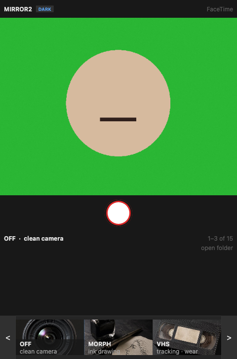
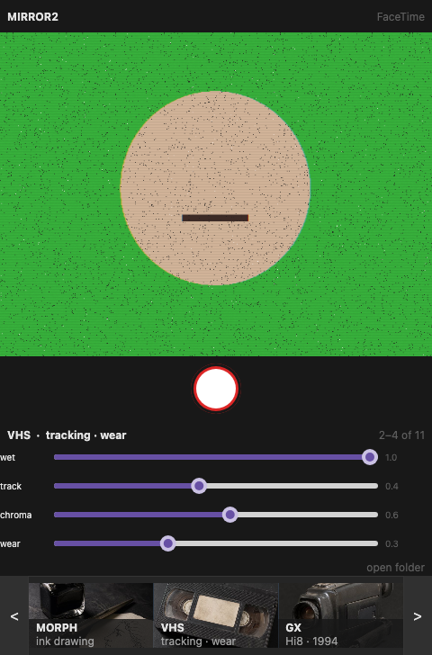
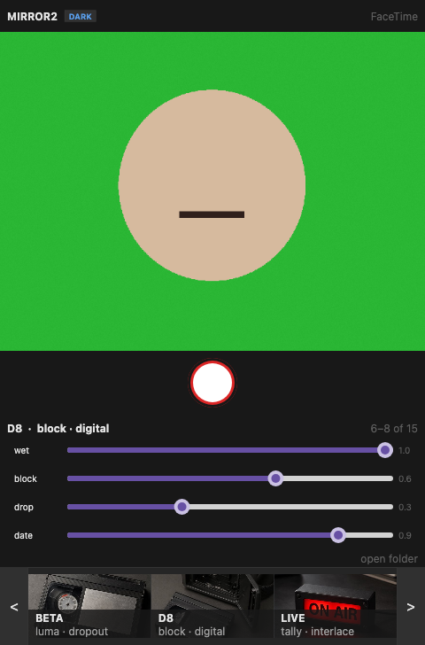
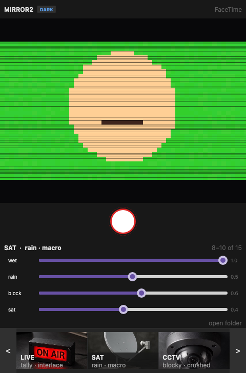
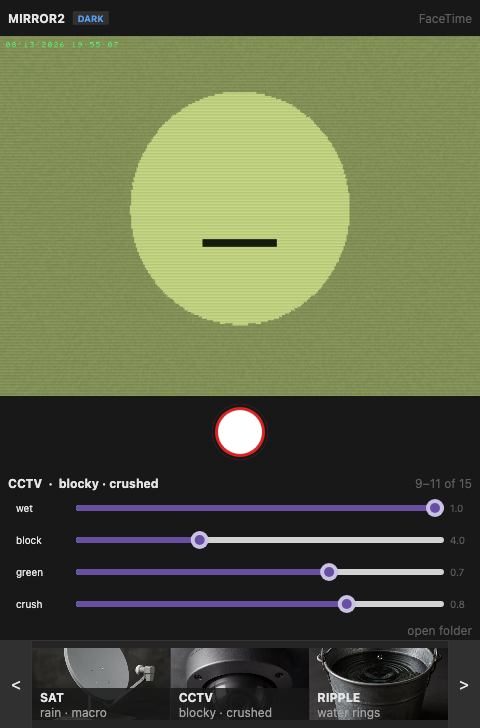
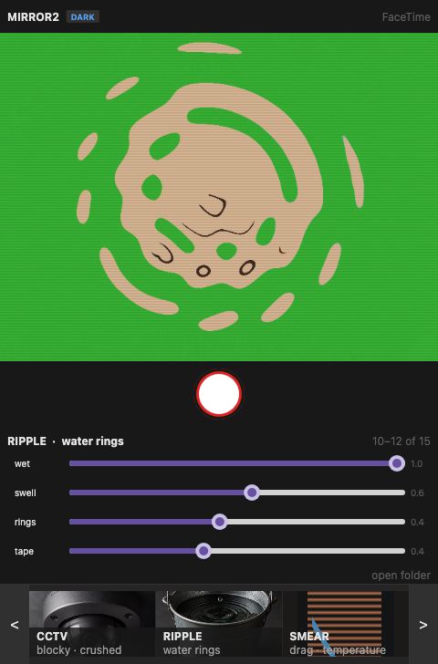
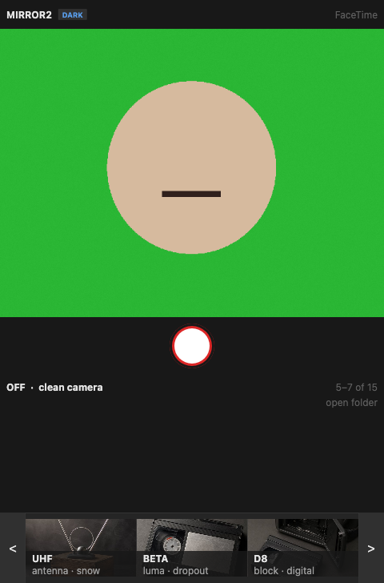

# Mirror2

Outsider spiritual successor to Photo Booth.

No curtains. No booth. No fake materials.

You sit. You pick a look. The camera well is always the preview. You keep a still.

## Screenshots

| Clean camera | VHS · tracking · wear | D8 · block · digital |
|:---:|:---:|:---:|
|  |  |  |

| SAT · rain · macro | CCTV · blocky · crushed | RIPPLE · water rings |
|:---:|:---:|:---:|
|  |  |  |

| Tape catalog dock (UHF · BETA · D8) |
|:---:|
|  |

Dock cards are photoreal still-life specimens. Chevrons page through 15 looks.

```
 MIRROR2                           NEW TOWER
 ┌─────────────────────────────────────────┐
 │              live camera                │
 │         (480 × 360, locked)             │
 └─────────────────────────────────────────┘
              ◉ shutter
         wet · sliders · open folder
   <  OFF   VHS   GX   >        chevron dock
```

## Looks (v0.1)

| Look | Line | Family |
|------|------|--------|
| **OFF** | clean camera | — |
| **MORPH** | ink drawing | paper |
| **VHS** | tracking · wear | tape |
| **GX** | Hi8 · 1994 | tape |
| **UHF** | antenna · snow | tape |
| **BETA** | luma · dropout | tape |
| **D8** | block · digital | tape |
| **LIVE** | tally · interlace | tape |
| **SAT** | rain · macro | tape (16:9 letterbox) |
| **CCTV** | blocky · crushed | eye |
| **RIPPLE** | water rings | water |
| **SMEAR** | drag · temperature | optics |
| **BREATHE** | inhale · exhale | body |
| **FILM** | sprockets · rebate | material |
| **WAVES** | sepia · film | material |

Dock cards show photoreal still-life specimens. Chevrons page the catalog.

## Run it (macOS)

Camera permission must belong to the app bundle, not Terminal:

```bash
./scripts/run.sh
```

Quit any old window before relaunching — stale binaries are the usual reason changes do not show up.

**Space** or the shutter: 3 · 2 · 1, flash, then the still saves to `~/Pictures/Mirror2`.

## Stack

Rust + [Freya](https://freyaui.dev) + AVFoundation (32BGRA). New Tower.

## Layout

Fixed **480×728** window. Shutter centered on the spine. Layout regression tests in `main.rs` (`layout_stone_nothing_walks_off_the_glass`).

Regenerate README screenshots:

```bash
cargo test export_readme_screenshots
```
